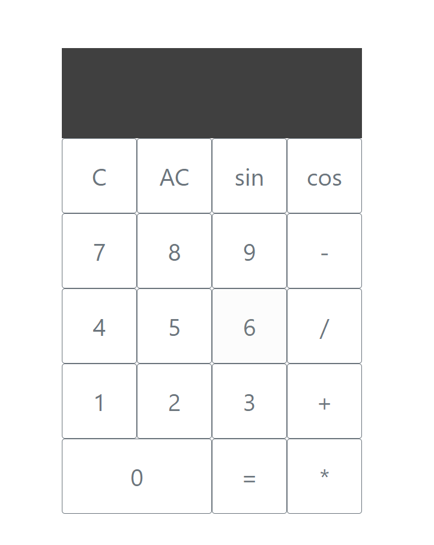

# calculator

* [Cemil Ylmaz](https://github.com/Cemil1000)

* 18.11.2020

## What is this ?
It is a calculator most scientific.

## Purpose?
Code a calculator with JavaScript and use html as a minimum.

## Functionalities
* +, -, x, /
* Sin, cos
* History

## Functionalities that need improvements
* Limit the operators
* Add the % and ²

## Languages used?
* HTML
* CSS
* Bootstrap
* JavaScript

### Original instruction

[Link](https://github.com/becodeorg/bxl-hopper-1-25/tree/master/The%20Hill/projects/1.calculator)

## Overview 
[My calculator](https://cemil1000.github.io/calculator/)
 